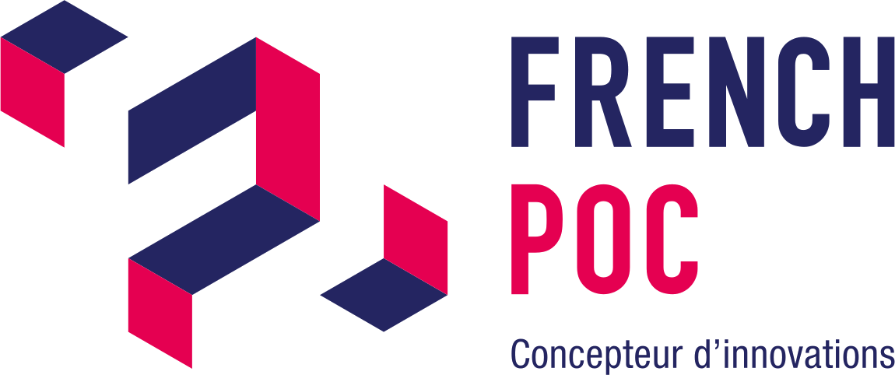

<h1 align="center">Le French POC</h1>

  

## Abstract

Re-industrialize territories to produce in France. 
This is the ambition at the heart of the creation of the industrial innovation platform Le French POC by a group of public-private partners.

The French POC is aimed at companies wishing to create a new product, while optimizing their time and reducing their risk-taking around value creation.

In order to provide these companies with an environment of high value-added industrial expertise, the French POC opened its doors in October 2019 in Miribel on the territory of the Communauté de communes de Miribel et du Plateau, located in the Ain, France's leading industrial department, in the immediate vicinity of the Lyon metropolis.

## Open Source

Open source enables open and unrestricted access to software, data, and resources needed for the creation and development of new technologies. By utilizing open source solutions, we are able to accelerate our innovation process by leveraging the knowledge and contributions of a global community of developers and experts.

By contributing to open source, we participate in the continuous improvement of existing technologies and foster the emergence of new solutions. We share our expertise and resources with the community, strengthening collaboration and multiplying opportunities for cooperation with other industry stakeholders.

Open source also promotes transparency, flexibility, and interoperability. By using open source technologies, we reduce our dependence on specific vendors and gain the freedom to customize and adapt solutions according to our specific needs. This enables us to innovate faster and respond more effectively to changing market requirements.

Website : [https://www.lefrenchpoc.fr/](https://www.lefrenchpoc.fr/)
